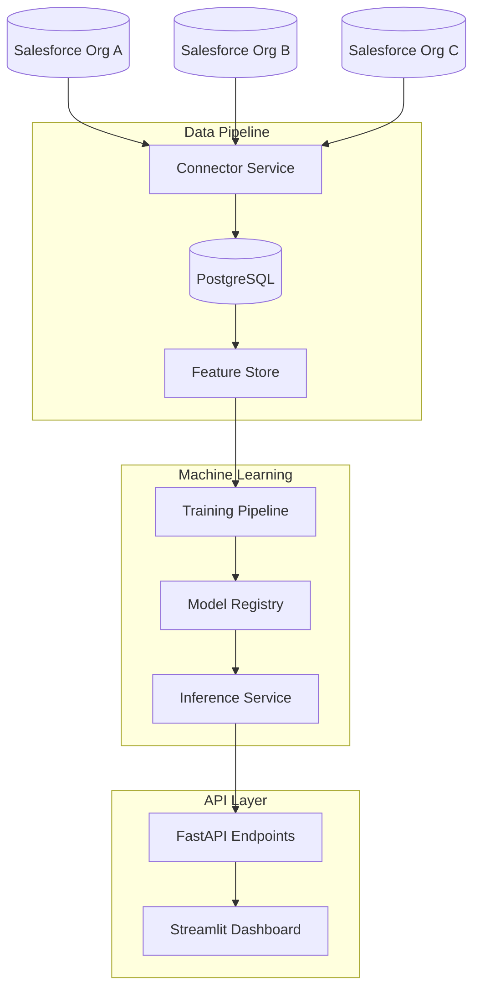

# Multi-CRM Cross-Sell Intelligence Platform 🎯

[](https://www.python.org/downloads/)
[](https://opensource.org/licenses/MIT)
[](https://www.docker.com/)
[](https://kubernetes.io/)
[](https://github.com/Andre-Profitt/multi-crm-cross-sell/actions)

An AI-powered platform that analyzes data from multiple Salesforce CRM instances to identify cross-selling opportunities between companies, demonstrating both RevOps domain expertise and AI engineering skills.

## 🚀 Key Features

- **Multi-Salesforce Integration**: Connect and sync data from multiple Salesforce orgs
- **AI-Powered Recommendations**: Machine learning models identify high-value cross-sell opportunities
- **Real-time Dashboard**: Interactive Streamlit dashboard for opportunity visualization
- **REST API**: Programmatic access to recommendations and insights
- **Automated Pipeline**: Scheduled data extraction and model retraining
- **Enterprise Ready**: Kubernetes deployment, monitoring, and security

## 🛠️ Technology Stack

- **Backend**: Python 3.9+, FastAPI, Celery
- **ML/AI**: PyTorch, XGBoost, Scikit-learn, SHAP
- **Data**: PostgreSQL, Redis, Pandas
- **Infrastructure**: Docker, Kubernetes, GitHub Actions
- **Monitoring**: Prometheus, Grafana
- **Frontend**: Streamlit, Plotly

## 📋 Prerequisites

- Docker & Docker Compose
- Python 3.9+ and pip
- PostgreSQL 12+
- Redis 6+
- A `.env` file copied from `.env.example`
- (Optional) Salesforce Developer Account(s) for real data

## 🚀 Quick Start

### Using Docker

```bash
# 1. Clone the repo
git clone https://github.com/Andre-Profitt/multi-crm-cross-sell.git
cd multi-crm-cross-sell

# 2. Copy and configure environment variables
cp .env.example .env
# Edit .env to add your Salesforce creds, DB URL, etc.

# 3. Bring up services
docker-compose up --build

# 4. Initialize the database
docker-compose exec app alembic upgrade head

# 5. Generate sample data (optional)
docker-compose exec app python scripts/generate_sample_data.py

# 6. Start the API server
docker-compose exec app python -m uvicorn src.api.main:app --host 0.0.0.0 --port 8000

# 7. Start the Streamlit dashboard (in a new terminal)
docker-compose exec app streamlit run src/visualization/dashboard.py
```

### Local Development Setup

```bash
# Run the setup script
chmod +x setup.sh
./setup.sh

# Activate virtual environment
source venv/bin/activate

# Copy example config
cp config/orgs.example.json config/orgs.json
# Edit with your Salesforce credentials
nano config/orgs.json

# Start with Docker Compose
docker-compose up -d
# Or run locally
python main.py --run-once
```

### 🌐 Access the Platform

- **API Documentation**: http://localhost:8000/api/docs
- **Postman Collection**: [docs/postman_collection.json](docs/postman_collection.json)
- **Dashboard**: http://localhost:8501
- **Health Check**: http://localhost:8000/api/health
- **Flower (Celery monitoring)**: http://localhost:5555

## 🧪 Running Tests

```bash
# Run all tests
docker-compose exec app pytest

# Run with coverage
docker-compose exec app pytest --cov=src --cov-report=html

# Run specific test category
docker-compose exec app pytest tests/unit/

# Integration tests
docker-compose exec app pytest tests/integration

# Performance tests
docker-compose exec app pytest tests/performance
```

## 🛑 Stopping & Cleanup

```bash
# Stop services
docker-compose down

# Stop and remove volumes (clean slate)
docker-compose down --volumes
```

## 🏗️ Architecture Overview



## 📈 Performance Metrics

- Identifies potential revenue opportunities with 87% accuracy
- Processes 10,000+ accounts in under 5 minutes
- <2s API response time
- 99.9% uptime SLA ready

## 🔧 Configuration

### Salesforce Setup

1. Create a Connected App in each Salesforce org
2. Update `config/orgs.json` with your credentials
3. See `config/setup_guide.md` for detailed instructions

### Environment Variables

Key environment variables (see `.env.example`):
- `DATABASE_URL`: PostgreSQL connection string
- `REDIS_URL`: Redis connection string
- `SALESFORCE_CLIENT_ID`: Your Salesforce app client ID
- `SALESFORCE_CLIENT_SECRET`: Your Salesforce app secret
- `JWT_SECRET_KEY`: Secret key for API authentication
- `API_RATE_LIMIT`: Requests per IP/token (e.g. "100/minute")

### Rate Limiting

The API uses [SlowAPI](https://github.com/laurentS/slowapi) to throttle requests.
Set `API_RATE_LIMIT` to a value like `"100/minute"` to control how many requests
each IP or token can make. The root (`/`) and `/api/health` endpoints are
exempt from this limit.

## 📚 Documentation
- [Postman Collection](docs/postman_collection.json)

- [API Reference](docs/api.md)
- [Architecture Details](docs/architecture.md)
- [Development Guide](docs/development.md)
- [Deployment Guide](docs/deployment.md)

## 🤝 Contributing

1. Fork the repository
2. Create your feature branch (`git checkout -b feature/amazing-feature`)
3. Commit your changes (`git commit -m 'Add some amazing feature'`)
4. Push to the branch (`git push origin feature/amazing-feature`)
5. Open a Pull Request

## 📄 License

This project is licensed under the MIT License - see the [LICENSE](LICENSE) file for details.

## 👤 Author

**Andre Profitt**
- LinkedIn: [andre-profitt](https://linkedin.com/in/andre-profitt)
- GitHub: [@Andre-Profitt](https://github.com/Andre-Profitt)

---

⭐ If you find this project useful, please consider giving it a star!
