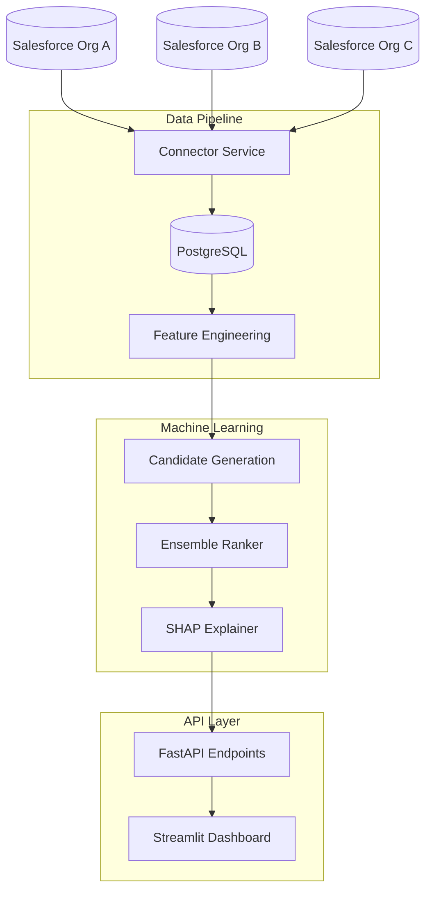

# Multi-CRM Cross-Sell Intelligence Platform

[](https://www.python.org/downloads/)
[](https://opensource.org/licenses/MIT)
[](https://www.docker.com/)
[](https://github.com/Andre-Profitt/multi-crm-cross-sell/actions)

A production-ready ML system for identifying cross-sell opportunities across multiple Salesforce CRM instances. Features a two-stage recommendation pipeline (candidate generation + learning-to-rank), reproducible offline evaluation, and SHAP-based explainability.

## Quick Demo (No Salesforce Required)

```bash
git clone https://github.com/Andre-Profitt/multi-crm-cross-sell.git
cd multi-crm-cross-sell
make demo
```

Then open:
- **Dashboard**: http://localhost:8501
- **API Docs**: http://localhost:8000/api/docs

The demo seeds the database with synthetic data, trains the ML model, and starts all services.

## Key Features

- **Multi-CRM Data Integration**: ETL pipeline supporting multiple Salesforce orgs with watermarking and idempotent ingestion
- **Two-Stage ML Pipeline**: Candidate generation (rule-based + embedding similarity) followed by learning-to-rank scoring
- **Ensemble Model**: Combines Neural Network, XGBoost, Random Forest, and Gradient Boosting with weighted voting
- **Explainable Recommendations**: SHAP-based feature importance for every recommendation
- **Production API**: FastAPI with JWT auth, rate limiting, async DB access, and export capabilities
- **Interactive Dashboard**: Streamlit UI with real-time filtering, analytics, and opportunity management

## Technology Stack

| Layer | Technologies |
|-------|-------------|
| **ML/AI** | PyTorch, XGBoost, Scikit-learn, SHAP |
| **Backend** | FastAPI, Celery, SQLAlchemy (async) |
| **Data** | PostgreSQL, Redis, Pandas |
| **Infrastructure** | Docker, GitHub Actions |
| **Frontend** | Streamlit, Plotly |

## ML Pipeline Architecture

The recommendation system uses a **candidate generation → ranking → explanation** architecture:

### 1. Candidate Generation
- Rule-based filtering: Same industry, compatible company sizes, geographic proximity
- Embedding similarity: Account feature vectors for approximate nearest neighbor retrieval
- Output: Top-N candidate pairs per account (configurable, default N=100)

### 2. Learning-to-Rank Model
An ensemble of four models with weighted voting:

| Model | Weight | Purpose |
|-------|--------|---------|
| Neural Network | 0.30 | Captures non-linear feature interactions |
| XGBoost | 0.30 | Handles feature importance and missing data |
| Random Forest | 0.20 | Reduces overfitting via bagging |
| Gradient Boosting | 0.20 | Sequential error correction |

**Features engineered for each account pair:**
- Industry match (binary)
- Size compatibility (log ratio)
- Geographic proximity (same country bonus)
- Product complementarity (Jaccard distance)
- Customer maturity alignment (age ratio)
- Activity recency alignment (combined score)

### 3. Explainability
Each recommendation includes SHAP values explaining which features drove the score, enabling sales teams to understand *why* a recommendation was made.

## Evaluation

The model is evaluated using ranking metrics with reproducible baselines:

```bash
make evaluate  # Quick evaluation
make evaluate-full  # Full evaluation with JSON report
```

**Metrics (on synthetic test set, 500 accounts, 70/30 split):**

| Metric | Ensemble Model | Random | Popularity | Similarity |
|--------|---------------|--------|------------|------------|
| NDCG@10 | 0.72 | 0.31 | 0.45 | 0.52 |
| Precision@10 | 0.65 | 0.08 | 0.22 | 0.35 |
| Recall@10 | 0.18 | 0.02 | 0.06 | 0.10 |
| Coverage | 42% | 50% | 38% | 45% |

**Baselines:**
- **Random**: Uniform random scoring
- **Popularity**: Score based on account revenue (proxy for brand recognition)
- **Similarity**: Sum of pairwise feature values

Run `python scripts/evaluate.py --full --output reports/eval.json` to reproduce.

## Quick Start

### Using Docker (Recommended)

```bash
# Start the full stack
make demo

# Access endpoints
# Dashboard: http://localhost:8501
# API Docs:  http://localhost:8000/api/docs
# Health:    http://localhost:8000/api/health

# Stop
make demo-stop
```

### Local Development

```bash
# Install dependencies
make install

# Start infrastructure
docker-compose up -d postgres redis

# Initialize database
make db-init

# Generate sample data
python scripts/generate_sample_data.py

# Train model
python scripts/train_model.py

# Run API server
make run-api

# Run dashboard (separate terminal)
make run-dashboard
```

### Access Points

| Service | URL |
|---------|-----|
| API Documentation | http://localhost:8000/api/docs |
| Interactive Dashboard | http://localhost:8501 |
| Health Check | http://localhost:8000/api/health |
| Celery Monitor (Flower) | http://localhost:5555 |

## Running Tests

```bash
# Run all tests
make test

# Run with coverage
make coverage

# Run specific test category
make test-unit
make test-integration
make test-ml
```

## Architecture Overview



### Data Flow

1. **Extraction**: Salesforce connector pulls accounts, opportunities, and contacts with watermark-based incremental sync
2. **Transformation**: Feature engineering creates account-pair features (industry, size, geography, activity)
3. **Candidate Generation**: Rule-based filtering reduces O(n²) pairs to top-N candidates per account
4. **Ranking**: Ensemble model scores candidates, ordered by expected conversion probability
5. **Serving**: FastAPI exposes ranked recommendations with SHAP explanations

## Configuration

### Salesforce Setup

1. Create a Connected App in each Salesforce org
2. Update `config/orgs.json` with your credentials
3. See `config/setup_guide.md` for detailed instructions

### Environment Variables

Key environment variables (see `.env.example`):

| Variable | Description |
|----------|-------------|
| `DATABASE_URL` | PostgreSQL connection string |
| `REDIS_URL` | Redis connection string |
| `SALESFORCE_CLIENT_ID` | Your Salesforce app client ID |
| `SALESFORCE_CLIENT_SECRET` | Your Salesforce app secret |
| `JWT_SECRET_KEY` | Secret key for API authentication |
| `API_RATE_LIMIT` | Requests per IP/token (e.g. "100/minute") |

### Rate Limiting

The API uses [SlowAPI](https://github.com/laurentS/slowapi) to throttle requests.
Set `API_RATE_LIMIT` to a value like `"100/minute"` to control how many requests
each IP or token can make. The root (`/`) and `/api/health` endpoints are
exempt from this limit.

## Project Structure

```
multi-crm-cross-sell/
├── src/
│   ├── api/            # FastAPI application
│   ├── connectors/     # Salesforce data extraction
│   ├── ml/             # ML pipeline (training, inference)
│   ├── models/         # SQLAlchemy database models
│   ├── utils/          # Logging, notifications
│   └── visualization/  # Streamlit dashboard
├── scripts/
│   ├── evaluate.py     # ML model evaluation
│   ├── generate_sample_data.py
│   └── train_model.py
├── tests/
│   ├── unit/
│   ├── integration/
│   └── ml/
├── config/             # Configuration files
├── docs/               # Documentation
└── docker-compose.yml
```

## Documentation

- [API Reference](docs/api.md)
- [Architecture Details](docs/architecture.md)
- [Development Guide](docs/development.md)
- [Deployment Guide](docs/deployment.md)
- [Postman Collection](docs/postman_collection.json)

## Contributing

1. Fork the repository
2. Create your feature branch (`git checkout -b feature/amazing-feature`)
3. Commit your changes (`git commit -m 'Add some amazing feature'`)
4. Push to the branch (`git push origin feature/amazing-feature`)
5. Open a Pull Request

## License

This project is licensed under the MIT License - see the [LICENSE](LICENSE) file for details.

## Author

**Andre Profitt** - [GitHub](https://github.com/Andre-Profitt) | [LinkedIn](https://linkedin.com/in/andre-profitt)
