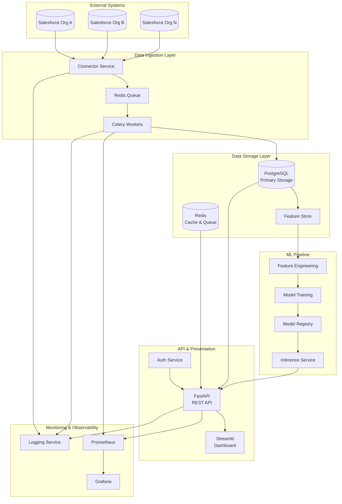

# Architecture Overview

## System Architecture

The Multi-CRM Cross-Sell Intelligence Platform follows a microservices architecture pattern with clear separation of concerns.

## Component Details

### 1. Data Ingestion Layer

**Connector Service**
- Manages connections to multiple Salesforce orgs
- Implements OAuth 2.0 authentication
- Handles rate limiting and retry logic
- Supports bulk data extraction

**Celery Workers**
- Asynchronous task processing
- Scheduled data sync jobs
- Error handling and retry mechanisms

### 2. Data Storage Layer

**PostgreSQL**
- Primary data store for accounts, opportunities, and recommendations
- ACID compliance for data integrity
- Supports complex queries for analytics

**Redis**
- Task queue for Celery
- API response caching
- Session storage

**Feature Store**
- Centralized repository for ML features
- Version control for feature definitions
- Ensures consistency between training and inference

### 3. ML Pipeline

**Feature Engineering**
- Account similarity scoring
- Industry matching algorithms
- Revenue potential calculations
- Activity pattern analysis

**Model Training**
- Ensemble approach: XGBoost, Random Forest, Neural Network
- Cross-validation for model selection
- Hyperparameter tuning with Optuna
- SHAP values for explainability

**Model Registry**
- Version control for models
- A/B testing capabilities
- Performance tracking
- Rollback support

### 4. API & Presentation Layer

**FastAPI**
- RESTful API design
- OpenAPI documentation
- JWT authentication
- Rate limiting
- Async request handling

**Streamlit Dashboard**
- Real-time opportunity visualization
- Interactive filtering
- Export capabilities
- Performance metrics

### 5. Security Architecture

## Data Flow

1. **Data Collection**: Scheduled jobs extract data from Salesforce orgs
2. **Data Processing**: ETL pipeline cleanses and standardizes data
3. **Feature Generation**: Features are computed and stored
4. **Model Training**: ML models are trained on historical data
5. **Inference**: Real-time scoring of cross-sell opportunities
6. **Presentation**: Results displayed via API and dashboard

## Scalability Considerations

- **Horizontal Scaling**: All services are containerized and stateless
- **Database Sharding**: Ready for sharding by org_id
- **Caching Strategy**: Multi-level caching (Redis, API, CDN)
- **Async Processing**: Non-blocking operations for better throughput

## Technology Choices Rationale

| Component | Technology | Rationale |
|-----------|------------|-----------|
| API Framework | FastAPI | Async support, automatic docs, type hints |
| ML Framework | PyTorch + XGBoost | Flexibility + performance |
| Database | PostgreSQL | ACID compliance, JSON support |
| Cache | Redis | Performance, pub/sub capabilities |
| Container | Docker | Consistency across environments |
| Orchestration | Kubernetes | Production-grade scaling |
| CI/CD | GitHub Actions | Native GitHub integration |
